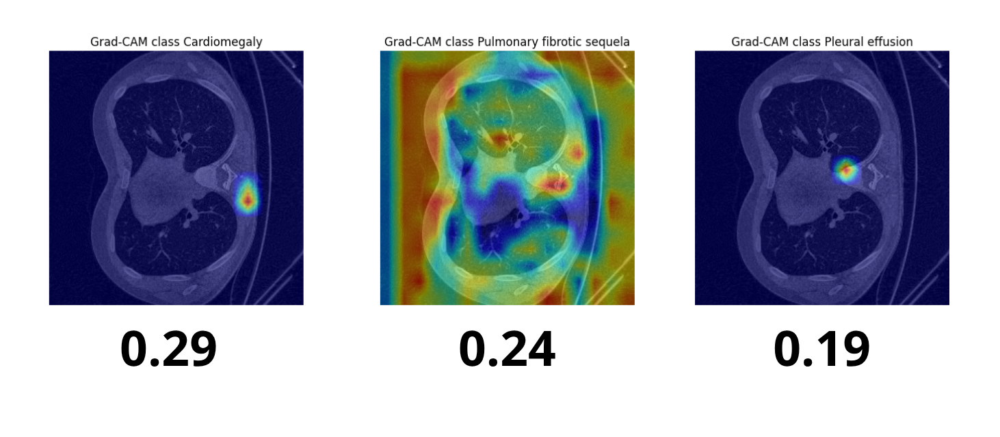

# Detection-and-Identification-of-Abnormalities-in-CT-SCAN-Images-Using-Explainable-AI
Group number : 1
Group member : 
1. Muhammad Arsyad Setiawan
2. Batsnah Nabila Zahidah

# 🩺 3D Chest Abnormality Classification using CT-Scan and Explainable AI (Grad-CAM)

This repository contains the implementation of a deep learning model for **multi-class abnormality classification** on 3D CT-Scan chest images.  
The project aims to enhance **clinical transparency** and **interpretability** using **Explainable AI** (Grad-CAM) visualization techniques.

---

## 📌 Project Overview

This research focuses on developing a **3D-based deep learning architecture** capable of recognizing **18 types of chest abnormalities** from CT-Scan volumes.  
In addition, the project integrates **Grad-CAM** to visualize which anatomical regions influenced the model’s decisions, supporting **explainable and trustworthy AI** in medical imaging.

---

## 🎯 Objectives

- Develop a 3D classification model to detect multiple chest abnormalities.  
- Implement **Explainable AI** (Grad-CAM) for visual interpretability of model predictions.  
- Evaluate model performance using various metrics (Accuracy, mAP, MCC).  

---

## 🧠 Model Architecture

The proposed model, **CTXNet**, is a custom 3D CNN architecture designed for volumetric CT-Scan data.

**Model Highlights:**
- 3D convolutional layers for volumetric feature extraction  
- Batch normalization and dropout for regularization  
- Grad-CAM visualization layer for interpretability  

**Best Model Performance:**
| Metric | Train | Test |
|--------|-------|------|
| Accuracy | 61% | 59% |
| mAP | 27.41% | 28.20% |
| MCC | 0.126 | 0.178 |

---

## 🧾 Dataset

- **Source:** 3D CT-Scan chest dataset containing 18 abnormality classes  
- **Preprocessing:**  
  - Resampling voxel size to uniform grid  
  - Intensity normalization  
  - Augmentation (random rotation, flipping, cropping)  

> ⚠️ you can access the data set on this link : https://huggingface.co/datasets/ibrahimhamamci/CT-RATE

---

## 🔍 Explainable AI Integration

This project applies **Grad-CAM (Gradient-weighted Class Activation Mapping)** to visualize regions contributing most to the model’s decision.  
These visualizations help clinicians interpret model outputs and verify diagnostic relevance.

Example visualization:

